# Sliding Window

| Difficulty |                           LeetCode                           | Note |
| :--------: | :----------------------------------------------------------: | :--: |
|     🔴      | [76. Minimum Window Substring](https://leetcode.com/problems/minimum-window-substring/) |[76. Minimum Window Substring](#76-minimum-window-substring)      |
|     🟠      | [567. Permutation in String](https://leetcode.com/problems/permutation-in-string/) |[567. Permutation in String](#567-permutation-in-string)      |
|     🟠      | [438. Find All Anagrams in a String](https://leetcode.com/problems/find-all-anagrams-in-a-string/) |[438. Find All Anagrams in a String](#438-find-all-anagrams-in-a-string)      |
|     🟠      | [3. Longest Substring Without Repeating Characters](https://leetcode.com/problems/longest-substring-without-repeating-characters/) |[3. Longest Substring Without Repeating Characters](#3-longest-substring-without-repeating-characters)      |


滑动窗口算法的代码框架

```c++
void slidingWindow(string s) {
  unordered_map<char, int> window;
  
  int left = 0;
  int right = 0;
  while(right < s.size()) {
    // c 是将移入窗口的字符
    char c = s[right];
    // 增大窗口
    right++;
    // 进行窗口内数据的一系列更新
    ...
    while(window needs shrink) {
      // d 是将移出窗口的字符
      char d = s[left];
      // 缩小窗口‘
      left++;
      // 进行窗口内数据的一系列更新
      ...
    }
  }
}
```

## 76. Minimum Window Substring

Given two strings `s` and `t` of lengths `m` and `n` respectively, return *the **minimum window substring** of* `s` *such that every character in* `t` *(**including duplicates**) is included in the window. If there is no such substring**, return the empty string* `""`*.*

The testcases will be generated such that the answer is **unique**.

A **substring** is a contiguous sequence of characters within the string.

 

**Example 1:**

```
Input: s = "ADOBECODEBANC", t = "ABC"
Output: "BANC"
Explanation: The minimum window substring "BANC" includes 'A', 'B', and 'C' from string t.
```

**Example 2:**

```
Input: s = "a", t = "a"
Output: "a"
Explanation: The entire string s is the minimum window.
```

**Example 3:**

```
Input: s = "a", t = "aa"
Output: ""
Explanation: Both 'a's from t must be included in the window.
Since the largest window of s only has one 'a', return empty string.
```

 

**Constraints:**

- `m == s.length`
- `n == t.length`
- `1 <= m, n <= 105`
- `s` and `t` consist of uppercase and lowercase English letters.

---

1. 首先考虑窗口的区间，初始化`left = right = 0`，索引的区间为`[left,right)`，左闭右开的区间可以保证初始区间`[0,0)`不包含任何一个元素，同时`right`右移后的区间`[0,1)`包含了元素`0`
2. 先不断增加`right`扩大窗口`[left,right)`，直到窗口的字符串符合要求
3. 停止增加`right`，转而不断增加`left`以缩小窗口`[left,right)`，直到窗口中的字符串不再符合要求

```mermaid
graph TD
A[更新right和window] --> B[更新count]
B --> C{count是否等于tsize}
C -->|否1|A
C -->|是1|D[upgrate start and len]
D --> E[更新left和window]
E --> F[更新count]
F --> C
C -->|是2|E
C -->|否2|G[输出start/len]
```



```java
class Solution {
  public String minWindow(String s, String t) {
    HashMap<Character, Integer> window = new HashMap<>();
    HashMap<Character, Integer> need = new HashMap<>();
    for(int i = 0; i < t.length(); i++) {
      char c = t.charAt(i);
      need.put(c,t_map.getOrDefault(c,0)+1);
    }
    int left = 0;
    int right = 0;
    int count = 0;
    int len = Integer.MAX_VALUE;
    int start = 0;
    while(right < s.length()) {
      char c = s.charAt(right);
      right++;
      if(t_map.containsKey(c)) {
        window.put(c,window.getOrDefault(c,0)+1);
        if(window.get(c).equals(need.get(c))) {
          count++;
        }
      }
      while(valid == need.size()) {
        if(right - left < len) {
          start = len;
          len = right - left;
        }
        char d = s.charAt(left);
        left++;
        if(need.containsKey(d)) {
          if(window.get(d).equals(need.get(d))) {
            count--;
          }
          window.put(d, window.get(d)-1);
        }
      }
    }
    return len == Integer.MAX_VALUE ? "" : s.substring(start, start+len);
  }
}
```

## 567. Permutation in String

Given two strings `s1` and `s2`, return `true` *if* `s2` *contains a permutation of* `s1`*, or* `false` *otherwise*.

In other words, return `true` if one of `s1`'s permutations is the substring of `s2`.

 

**Example 1:**

```
Input: s1 = "ab", s2 = "eidbaooo"
Output: true
Explanation: s2 contains one permutation of s1 ("ba").
```

**Example 2:**

```
Input: s1 = "ab", s2 = "eidboaoo"
Output: false
```

 

**Constraints:**

- `1 <= s1.length, s2.length <= 104`
- `s1` and `s2` consist of lowercase English letters.

```java
class Solution {
  public boolean checkInclusion(String s1, String s2){
    HashMap<Character, Integer> need = new HashMap<>();
    HashMap<Character, Integer> window = new HashMap<>();
    for(int i = 0; i < s1.length(); i++) {
      char ch = s1.charAt(i);
      need.put(ch, need.getOrDefault(ch,0)+1);
    }
    int left = 0;
    int right = 0;
    int count = 0;
    while(right < s2.length()) {
      char c = s2.charAt(right);
      right++;
      if(need.containsKey(c)) {
        window.put(c, window.getOrDefault(c,0)+1);
        if(window.get(c).equals(need.get(c))) {
          count++;
        }
      }
      while(right - left >= s1.length()) {
        if(count == need.size()) {
          return true;
        }
        char d = s2.charAt(left);
        left++;
        if(need.containsKey(d)) {
          if(window.get(d).equals(need.get(d))) {
            count--;
          }
          window.put(d, window.get(d)-1);
        }
      }
    }
    return false;
  }
}
```

## 438. Find All Anagrams in a String

Given two strings `s` and `p`, return *an array of all the start indices of* `p`*'s anagrams in* `s`. You may return the answer in **any order**.

An **Anagram** is a word or phrase formed by rearranging the letters of a different word or phrase, typically using all the original letters exactly once.

 

**Example 1:**

```
Input: s = "cbaebabacd", p = "abc"
Output: [0,6]
Explanation:
The substring with start index = 0 is "cba", which is an anagram of "abc".
The substring with start index = 6 is "bac", which is an anagram of "abc".
```

**Example 2:**

```
Input: s = "abab", p = "ab"
Output: [0,1,2]
Explanation:
The substring with start index = 0 is "ab", which is an anagram of "ab".
The substring with start index = 1 is "ba", which is an anagram of "ab".
The substring with start index = 2 is "ab", which is an anagram of "ab".
```

 

**Constraints:**

- `1 <= s.length, p.length <= 3 * 104`
- `s` and `p` consist of lowercase English letters.

```java
class Solution {
  public List<Integer> findAnagrams(String s, String p) {
    HashMap<Character, Integer> window = new HashMap<>();
    HashMap<Character, Integer> need = new HashMap<>();
    for(int i = 0; i < p.length(); i++) {
      char c = p.charAt(i);
      right++;
      if(need.containsKey(c)) {
        window.put(c,window.getOrDefault(c,0)+1);
        if(window.get(c).equals(need.get(c))) {
          count++;
        }
      }
      while(right - left >= p.length()) {
        if(count == need.size()) {
          res.add(left);
        }
        char d = s.charAt(left);
        left++;
        if(need.containsKey(d)) {
          if(window.get(d).equals(need.get(d))) {
            count--;
          }
          window.put(d,window.get(d)-1);
        }
      }
    }
    return res;
  }
}
```

## 3. Longest Substring Without Repeating Characters

Given a string `s`, find the length of the **longest substring** without repeating characters.

 

**Example 1:**

```
Input: s = "abcabcbb"
Output: 3
Explanation: The answer is "abc", with the length of 3.
```

**Example 2:**

```
Input: s = "bbbbb"
Output: 1
Explanation: The answer is "b", with the length of 1.
```

**Example 3:**

```
Input: s = "pwwkew"
Output: 3
Explanation: The answer is "wke", with the length of 3.
Notice that the answer must be a substring, "pwke" is a subsequence and not a substring.
```

 

**Constraints:**

- `0 <= s.length <= 5 * 104`
- `s` consists of English letters, digits, symbols and spaces.

```java
class Solution {
  public int lengthOfLongestSubstring(String s) {
    HashMap<Character, Integer> window = new HashMap<>();
    int left = 0;
    int right = 0;
    int res = 0;
    while(right < s.length()) {
      char c = s.charAt(right);
      right++;
      window.put(c, window.getOrDefault(c,0)+1);
      while(window.get(c) > 1) {
        char d = s.charAt(left);
        left++;
        window.put(d, window.get(d)-1);
      }
      res = Math.max(res,right-left);
    }
    return res;
  }
}
```

